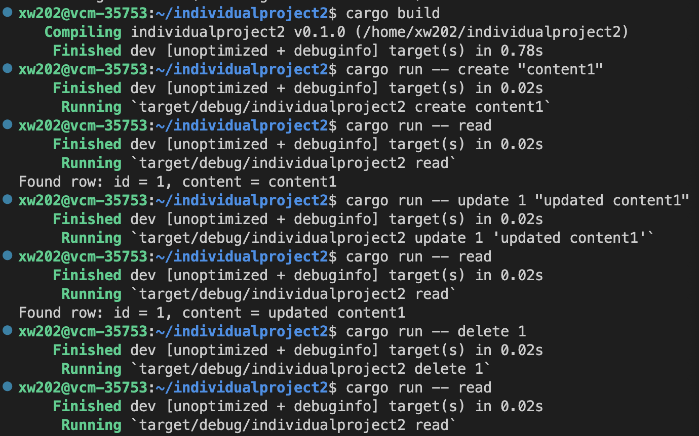
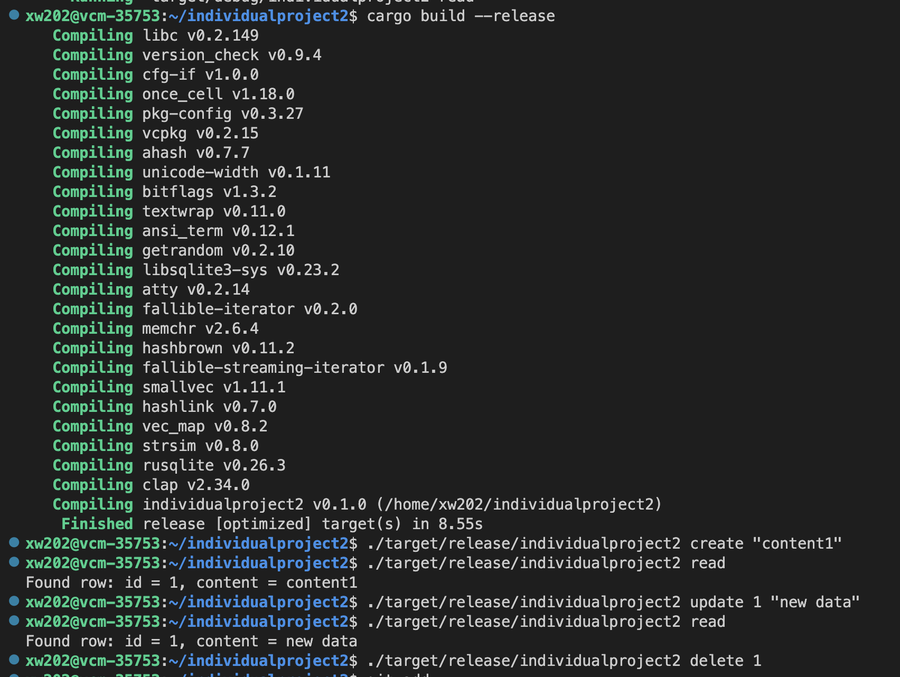

[](https://github.com/nogibjj/individualproject2/actions/workflows/rust_build.yml)
# Individual-Project2: Rust CLI Binary with SQLite

## Description
This project is a command-line interface (CLI) application written in Rust, integrated with an SQLite database. It's designed to demonstrate CRUD (Create, Read, Update, Delete) operations on a SQLite database using Rust's strong type system and safety features. This is the link to my [YouTube video](https://youtu.be/-kfbU7d7e8k).

## Use of Github Copilot
Most of the code were generated by Copilot. I wrote comment and copilot generated the code for me. Then i just need to do some modification for the generated code. It is very efficient.

## Dependencies
- Rust
- SQLite
- Clap
- Rusqlite

## User Guide
1. To install Rust and Cargo, follow the instructions here: [Install Rust](https://www.rust-lang.org/tools/install).
Install dependencies by running:
  ```
  cargo build
  ```
2. Clone the repository:
  ```sh
  git clone [https://github.com/nogibjj/individualproject2]
  ```
3. Change directory to the project folder:
  ```sh
  cd individualproject2
  ```

### CRUD:
create [CONTENT] - create an entry in this table
read - read all entries in this table
update [ID] [CONTENT] - Update an entry
delete [ID] - Delete an entry with corresponding ID

### Example:


## Production:
For deployment or distribution, you might want to build an optimized version of your application:

1. Build the Project in Release Mode:
   Compile your project with optimizations using:
   ```sh
   cargo build --release
   ```
   This command creates an optimized executable in the `./target/release/` directory.

2. Execute the Compiled Binary: 
   Run the binary directly from the terminal:
   - Create:
   ```
   ./target/release/individualproject2 create "content1"
   ```
   - Read:
   ```
   ./target/release/individualproject2 read
   ```
   - Update:
   ```
   ./target/release/individualproject2 update 1 "new content1"
   ```
   - Delete:
   ```
   ./target/release/individualproject2 delete 1
   ```  
  
### Example:

